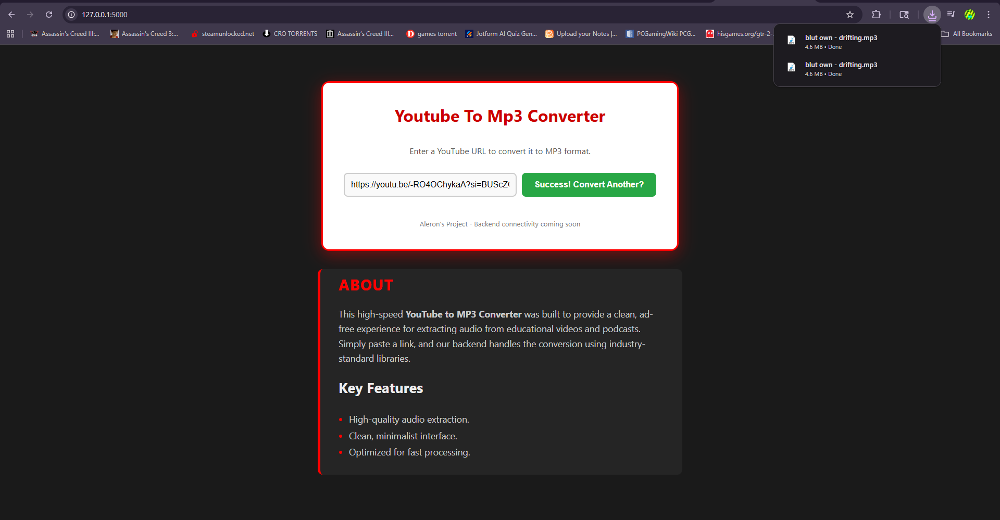

# 🎵 YouTube to MP3 & MP4 Pro (Desktop Edition)

**DISCLAIMER: This tool is for educational purposes and personal use only. Users are responsible for complying with YouTube's Terms of Service.**

A professional-grade, full-stack desktop application that converts YouTube videos to high-quality **MP3s and MP4s**. This project features a Python/Flask backend bundled into a standalone Windows Executable (`.exe`) with integrated FFmpeg/FFprobe processing.

## 📸 Interface


## ⚡ Quick Start (Windows)
**The easiest way to use this tool is to download the pre-packaged installer:**

1.  Navigate to the [Releases](https://github.com/AleronVaz/yt_mp3_downloader/releases) page.
2.  Download `Aleron_YtMP3_Setup.exe`.
3.  Run the installer. It will install the app to your Program Files and create a Desktop shortcut.
4.  Launch and start downloading!

---

## 🚀 Key Features
* **Professional Installer:** Distributed via a standard Windows Setup wizard for easy deployment.
* **MP3 & MP4 Support:** Toggle between high-quality audio and video formats.
* **Intelligent Quality Selection:** Forced H.264 (AVC) encoding for MP4s to ensure maximum compatibility with all Windows media players.
* **Standalone Portable EXE:** No Python installation required for the end-user.
* **Auto-Lifecycle Management:** Integrated **Heartbeat Logic** that automatically terminates the background server when the browser tab is closed to save system resources.
* **Desktop Integration:** Automatically downloads files to the user's standard `Downloads` folder for easy access.
* **High-Performance Engine:** Powered by `yt-dlp`, `FFmpeg`, and `FFprobe` for seamless media merging.

---

## 🛠️ The Architecture
This project uses a **Decoupled Desktop Architecture**. Instead of a standard GUI library, it utilizes a Flask web-server as the backend and a modern HTML/CSS/JS frontend, providing a superior UI/UX and mobile-first responsiveness.

### Technical Highlights:
* **Resource Pathing:** Uses custom `resource_path` logic to handle internal pathing within the PyInstaller `_MEIPASS` environment.
* **Multi-Threading:** Runs a background **Watchdog Thread** as a daemon to monitor browser pings.
* **Binary Bundling:** Bundles `ffmpeg.exe`, `ffprobe.exe`, `index.html`, and `static` assets into a single-file distribution.
* **Inno Setup Integration:** Includes an `.iss` script for compiling the final installation package.

---

## 🔍 The "Cloud vs. Residential" Challenge
* **The Problem:** Cloud platforms (Render/AWS) face heavy Data Center IP blocking and PO Token requirements.
* **The Solution:** Transitioning to a Desktop App utilizes **Residential IPs**, ensuring 100% functionality and bypassing automated bot detection.

---

## 📂 Project Structure
* `main.py`: Core Flask engine & lifecycle Watchdog logic.
* `installer_script.iss`: The Inno Setup configuration for the installer.
* `main.spec`: Configuration for the PyInstaller build process.
* `ffmpeg.exe` & `ffprobe.exe`: The core conversion and analysis engines (bundled).

---

## 📦 How to Build (For Developers)
If you want to compile the project yourself:

1.  **Clone & Install Dependencies:**
    ```bash
    git clone https://github.com/AleronVaz/yt_mp3_downloader.git
    pip install flask yt-dlp
    ```

2.  **Download Binaries:**
    To keep the repository lightweight, `ffmpeg.exe` and `ffprobe.exe` are not included in the source.
    * Download the latest builds from [Gyan.dev](https://www.gyan.dev/ffmpeg/builds/).
    * Extract `ffmpeg.exe` and `ffprobe.exe` from the `bin` folder and place them in the project root.

3.  **Generate EXE:**
    ```bash
    pyinstaller --noconsole --onefile --clean --icon=app_icon.ico --add-data "index.html;." --add-data "static;static" --add-data "ffmpeg.exe;." --add-data "ffprobe.exe;." main.py
    ```

4.  **Generate Installer:** Open `installer_script.iss` in Inno Setup and click **Compile**.

---

## 📱 Legacy Support: Mobile (Termux)
The project remains compatible as a local server on Android via **Termux**...